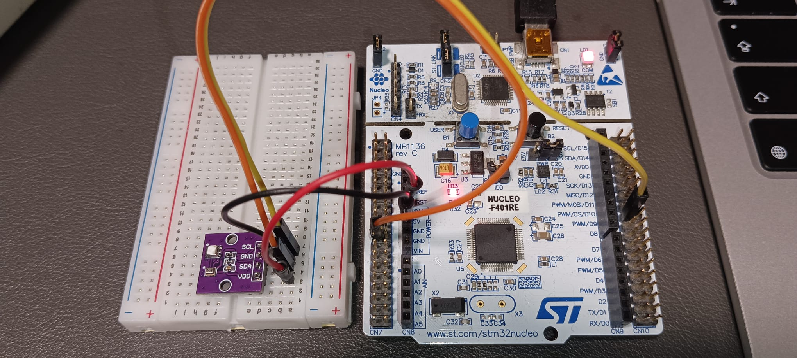
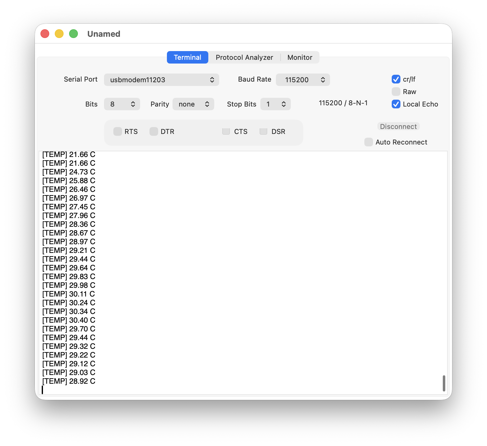
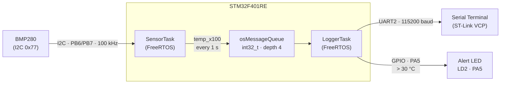
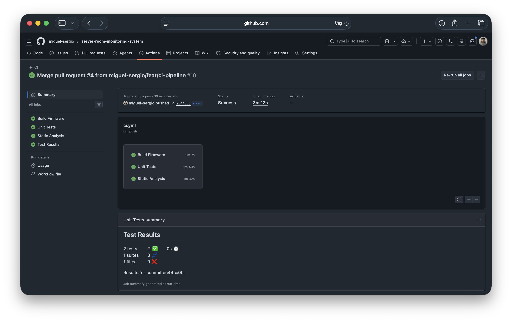

# Server Room Monitoring System

[](https://github.com/miguel-sergio/server-room-monitoring-system/actions/workflows/ci.yml)

## Overview

Server rooms require 24/7 temperature monitoring to prevent hardware failures.
A missed thermal event can cause costly downtime, hardware damage, or data loss.
This system implements a low-cost embedded monitor that reads temperature every
second and triggers a threshold alert when the temperature exceeds a configurable limit.

- Reads temperature from a **BMP280** sensor over **I2C** every 1 second.
- Streams readings over **UART** at 115200 baud (visible on any serial terminal).
- Activates an **alert LED** when temperature exceeds 30 °C.
- Runs sensor acquisition and logging as independent **FreeRTOS tasks** communicating via a message queue.

> **Development guide:** [guide.md](guide.md) walks through every milestone and explains the reasoning behind each decision, including interview angles for each topic.

| Hardware setup | Serial output |
|:---:|:---:|
|  |  |

## Hardware

| Component | Details |
|-----------|---------|
| MCU | STM32F401RE - NUCLEO-F401RE board |
| Sensor | AHT20+BMP280 module, using BMP280 temperature reading over I2C |
| I2C bus | PB6 (SCL), PB7 (SDA), 100 kHz |
| UART | PA2 (TX) / PA3 (RX) → ST-Link virtual COM port |
| Alert LED | LD2 on PA5 |

## System Architecture



## Design Decisions

- FreeRTOS separates sensor acquisition from logging and alert handling.
- A message queue decouples the sensor task from the logger task.
- UART is used for simple PC-side monitoring during system validation.
- Docker keeps the build and analysis environment reproducible.
- Host-side tests isolate BMP280 compensation logic from hardware-dependent code.

## Project Structure

```
├── Core/
│   ├── Inc/          # Headers: bmp280.h, app_tasks.h, main.h
│   └── Src/          # Sources: bmp280.c, app_tasks.c, main.c, freertos.c
├── Drivers/          # STM32 HAL + CMSIS (ST-generated)
├── tests/
│   ├── unity/        # Unity test framework (git submodule)
│   ├── stubs/        # HAL stubs for off-target testing
│   ├── test_bmp280_pure.c   # Tests for pure compensation logic
│   └── test_bmp280_i2c.c    # Tests for I2C driver with HAL mock
├── Dockerfile        # Reproducible build environment
├── .github/workflows/ci.yml
├── cppcheck-suppressions.txt
└── misra-deviations.md
```

## Build

### Prerequisites

Either install the toolchain locally or use the provided Docker image.

**With Docker (recommended):**
```bash
docker build -t stm32-monitor-build .
```

### Firmware

```bash
# With Docker
docker run --rm -v "$PWD":/workspace -w /workspace stm32-monitor-build \
  bash -c "cmake --preset Debug && cmake --build --preset Debug"

# Local
cmake --preset Debug
cmake --build --preset Debug
```

Output: `build/Debug/server-room-monitoring-system.elf`

**Flash with OpenOCD:**
```bash
openocd -f interface/stlink.cfg -f target/stm32f4x.cfg \
  -c "program build/Debug/server-room-monitoring-system.elf verify reset exit"
```

### Unit Tests

```bash
# With Docker
docker run --rm -v "$PWD":/workspace -w /workspace stm32-monitor-build \
  bash -c "cmake -G Ninja -B tests/build -S tests \
           && cmake --build tests/build \
           && cd tests/build && ctest -V"

# Local
cmake -G Ninja -B tests/build -S tests
cmake --build tests/build
cd tests/build && ctest -V
```

### Static Analysis (cppcheck + MISRA C:2012 checks)

```bash
cppcheck --enable=warning,style,performance,portability \
  --addon=misra \
  --error-exitcode=1 \
  --suppressions-list=cppcheck-suppressions.txt \
  -I Core/Inc \
  Core/Src/bmp280.c Core/Src/app_tasks.c Core/Src/main.c
```

MISRA-related findings and documented deviations are tracked in [`misra-deviations.md`](misra-deviations.md).

## CI Pipeline

Every push runs three parallel jobs on GitHub Actions, all inside the Docker container:

| Job | What it checks |
|-----|---------------|
| Build Firmware | cmake + ninja, ARM cross-compilation |
| Unit Tests | Unity framework, JUnit results published on PR |
| Static Analysis | cppcheck with MISRA C:2012 addon |



## Validation

The system was validated by:

- Checking UART temperature logs at 1-second intervals
- Forcing the temperature threshold condition and verifying LED activation
- Running Unity tests for BMP280 compensation and I2C driver logic
- Running cppcheck and MISRA C checks in CI
- Building the firmware inside Docker to verify reproducibility
